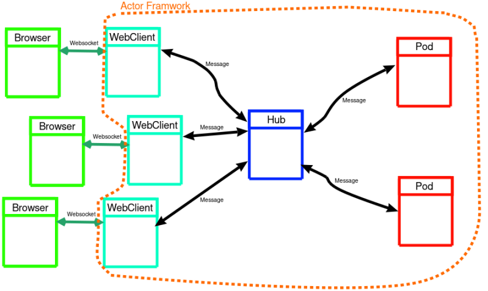

# Info
- using Kameo to model web access to distributed resources
- actor based approach
- WIP
- nothing useful yet

# Idea
- use Actor framwork for a distributed backend

- webfrontend represents a client actor and is conected with a pesistent Websocket connection to actors framework
- axum is used as a translation layer with a Websocket endpoint
  - it should translate between browser frontend and actor's world
  - each instance of front-end in browser should seen as an actor

# Reference
- Idea taken from presentation made by Stefan Schindler:
  - https://media.ccc.de/v/cosin-28-distributed_actor_system_with_rust
  - https://gitlab.com/dns2utf8/distributed-and-secure-systems
- Websocket code inspired by:
  - https://github.com/tokio-rs/axum/blob/main/examples/websockets/src/main.rs
  - https://medium.com/@itsuki.enjoy/rust-websocket-with-axum-for-realtime-communications-49a93468268f
